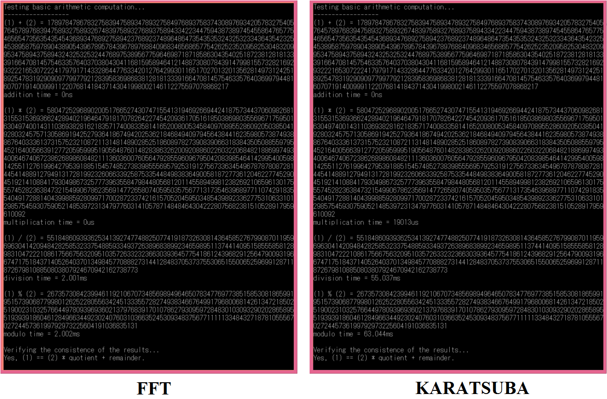

# Big Integer Computation

The class is aim at easily adoption for big integers computation with medium performance in c++ programming.

## Prerequisites

Place the ./src and ./include documents inside your project directory and include the BigInteger.h file in your *.cpp

```
#include "./include/BigInteger.h"
```


## Basic usage

```
#include <iostream>
#include "./include/BigInteger.h"

using namespace std;

int main(void) {

	BigInteger bigint_1("+12345678987654321");
	BigInteger bigint_2("-98765432123456789");

	cout << "bigint_1 - bigint_2 = " << bigint_1 - bigint_2 << endl;
	
	return 0;
}
```

See ./demo.cpp for more ideas about how to use the BigInteger class.

## Performance

The following picture demonstrates the performance of using the BigInteger class to work with large arbitrary integer number:

</img>

Note: The results are obtained from demo.cpp

## Author

* **Jason Lai** - jason99.lai@gmail.com
